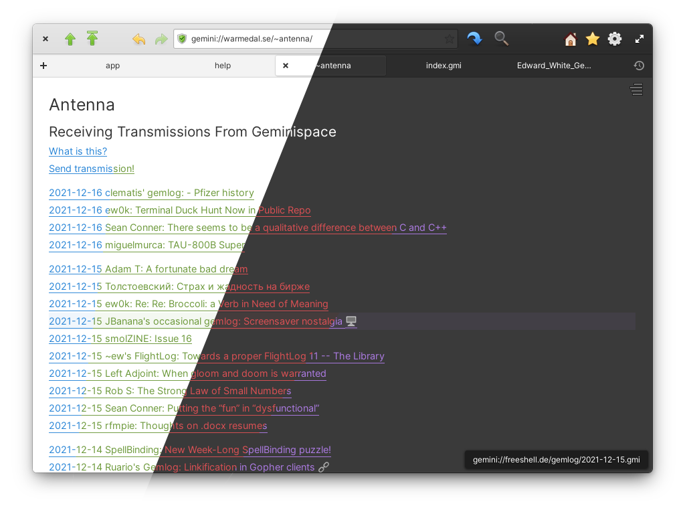
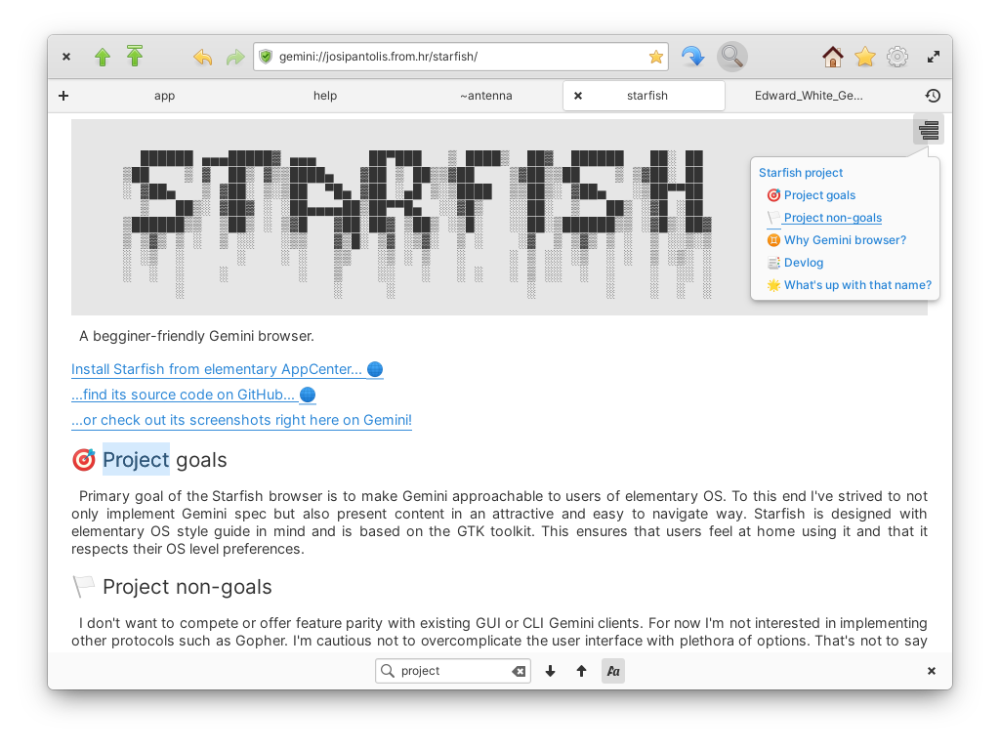

<h1>Starfish</h1>

A [Gemini](https://gemini.circumlunar.space/) browser made for [elementary OS](https://elementary.io/).

[](COPYING)
[](https://github.com/starfish-app/Starfish/actions)
[](https://github.com/starfish-app/Starfish/releases)
[](https://appcenter.elementary.io/hr.from.josipantolis.starfish)

|||
|----------------------------------------------------------------------------------------------------------------|----------------------------------------------------------------------------------------------------------------|
|||

For more screenshots check out the [screenshots directory](data/screenshots).

## About

Starfish is a graphical client for the Gemini protocol built with GTK and Vala. The main goal of the project is to provide a native elementary OS application for reading Gemini sites, that will make the protocol more accessible to users. Read more on the project's Gemini page: [gemini://josipantolis.from.hr/starfish/](gemini://josipantolis.from.hr/starfish/).

### Status

Starfish is in active development. It currently supports the prerelease version of the Gemini specification, including gemtext rendering and client certificates. Starfish can be used to view images and download other file types. There are still many improvements and new features that could be added to the app. For a list of current development plans check out [GitHub issues](https://github.com/starfish-app/Starfish/issues).

## Install

Starfish is packaged with [Flatpak](https://www.flatpak.org/) and published on elementary OS AppCenter. If you are running some other Linux distribution you can download the `flatpakref` file from [elementary repo](https://flatpak.elementary.io/repo/appstream/hr.from.josipantolis.starfish.flatpakref) and install it either using a graphical package manager, or from terminal with:

```sh
flatpak install --from ./hr.from.josipantolis.starfish.flatpakref
```

## Build from source

Starfish is built for elementary OS 6. All prerequisites can be met by installing `elementary-sdk` and `gtkspell`:

```sh
sudo apt install elementary-sdk
sudo apt install libgtkspell3-3-dev
```

For a full list of dependencies check out the `dependencies` list in the [meson.build file](meson.build#L11-L20).

To build and install the app execute (from project's root directory):

```sh
meson build --prefix=/usr
cd build
ninja
sudo ninja install
```

### Test

After performing meson build you can run tests from inside `build` directory with:

```sh
meson test
```

### Translate

After adding user facing strings, remember to wrap them `_("like so")`, from inside the `build` directory execute:

```sh
ninja hr.from.josipantolis.starfish-pot
ninja hr.from.josipantolis.starfish-update-po
```

## Package

Starfish is packaged as a Flatpak. You can build and install it locally with:

```sh
flatpak-builder build hr.from.josipantolis.starfish.yml --user --install --force-clean
```

## License

[GNU GPLv3](COPYING)

Copyright © 2021 Josip Antoliš, josip.antolis@protonmail.com.

